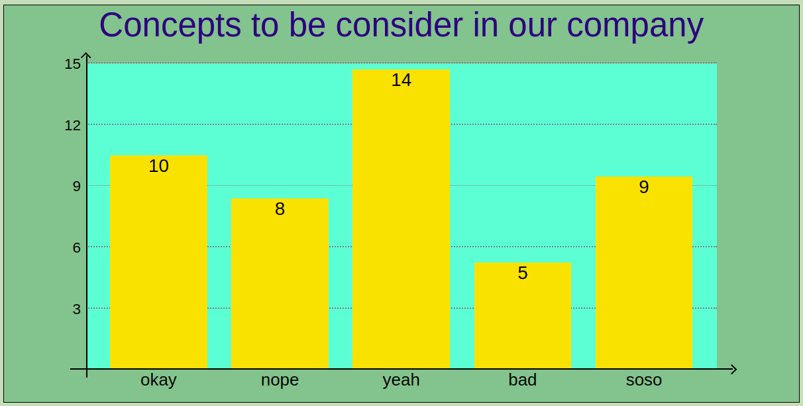

# barChart
bar chart program - LHL project

This is a project for the prep work LighHouse Labs BootCamp Web Developers, which will start in January 1st, 2019, in Vancouver.

It was asked to the students to develop a function in order to draw a bar chart using only Javascript, JQuery, CSS and HMTL elements.

The function is called by: *barChart(data, options, element)*.
- **Data** is the set of number that will be showed up in the bars. It may be 3 kinds of estrucutures:
  * Simple array, only numbers
  * Array of objects, where the key is the label and the value is the number
  * Array of arrays with 4 arrays. The first is the numbers, second is the label for each subcolumn
      third contains the colors for each subcolumn, and the forth is the X Axis label
- **Options** contain the fields that the user can set, such as colors, text, sizes, and some chart bar features.
- **Element** is the spot where the chart will be rendered.

Bellow follow one example for each type of data structure:
* **Simple Array**
In this case, data is:
      [100000, 200000, 150000, 350000, 88000, 77000, 89000, 100000],

Bar Chart is:

* **Array of Objects**
In this case, data is:
      [{"okay": 10},
       {"nope": 8},
       {"yeah": 14},
       {"bad":   5},
       {"soso": 9}],

Bar Chart is:        

* **Arrays of Arrays**
In this case, data is:
      [[[99, 88, 80, 70], ["North", "South", "East", "West"], ["navy", "olive", "orange", "teal"], "2014"],
       [[41, 50, 45, 40], ["North", "South", "East", "West"], ["navy", "olive", "orange", "teal"], "2015"],
       [[55, 66, 70, 59], ["North", "South", "East", "West"], ["navy", "olive", "orange", "teal"], "2016"],
       [[22, 33, 40, 30], ["North", "South", "East", "West"], ["navy", "olive", "orange", "teal"], "2017"]],      
        

## About options fields
Options are divided in 555555555555555555 parts:
1. bigFrame Features. This frame will hold all the elements for the bar chart.
It is possible to set the following:
  * frameHeight - big frame's height (pixels),
  * frameWidth - big frame's width (pixels),
  * color - it is the color for the big frame (it can receive any valid string, decimal or hexadecimal), and
  * border - border frame's features (format and color).
  *i.e.:*
      frameHeight: 400, frameWidth: 800,
      setBigFrameColor: "#E0E4E3", setBigFrameBorder: "solid 0.5px black",

1. chartFrame features. Some features related to the chart, such as:
  * setFrameColor - it will define the chart frame's background color,
  * setBarColor - it will be applied for charts with simple columns, and
  * setEmphasis <true or false> - when true, it will provide a different style for the hoved columns.

1. chartLabelFeatures defines 
  * chartLabelText - it is title for the chart,
  * chartLabelFontFamily - it is the font family,
  * chartLabelFontSize - size of the font. If the user defines a very big size, the system will adjust in order to fit in the label element
  * chartLabelFontColor - it is the color of the title,
  * chartLabelBorder - it defines border to the title, and
  * chartLabelBackColor - it is the background color. If it is not define, the color will be the same as the big frame's background.

1. X Axis features has:
  * setXLabel - it can receive "month" or "number" as a X label,
  * setXLabelStarts - for the cases above, the system can start in a specific month or number. If month, the others labels will be filled automatically,
  * setXLabelInc - applied to "numbers", it can increase (positive number) or decrease (for negative numbers,
  * setColumnsFont - font's size,
  * setColumnWithLabel < true or false> - it turns on or off the labels for the columns,
  * setLabelColumnPos - positioning of the label related to the column. It can be *top*, *bottom*, *middle* or *over*,
  * setSpaceColumn - it defines the space between the columns. 3 types: "small", "normal" or "extra".

1. Y Axis features has:
  * setMaximunValue - is the parameter for the Y axis. If no value, the maximum char height will be a small number after the maximum's data.
  * numberOfDivisionsYAxis - how many divisions in the Y axis,
  * typeOfDivision - if "percent" or absolute,
  * setDivLabelFontSize - font size, and
  * setDivisionsOverColumns <true or false> - it will show the division's lines over or under the columns.

## Improvements:
* There is a function to adjust the fontsize within the element, and it's working to the labelChart element, but I wanted to apply to other elements, such as the Y and X Axis labels, the legend and columns labels. This is one of the improvements.
* Another improvement I wanted to work is to adjust bigger numbers to the columns width.
* Also, I would like to figure out better the case of one more label for the Xs labels, such as year under the months.
* The review of the code and the functions was supposed to be better, as well.

