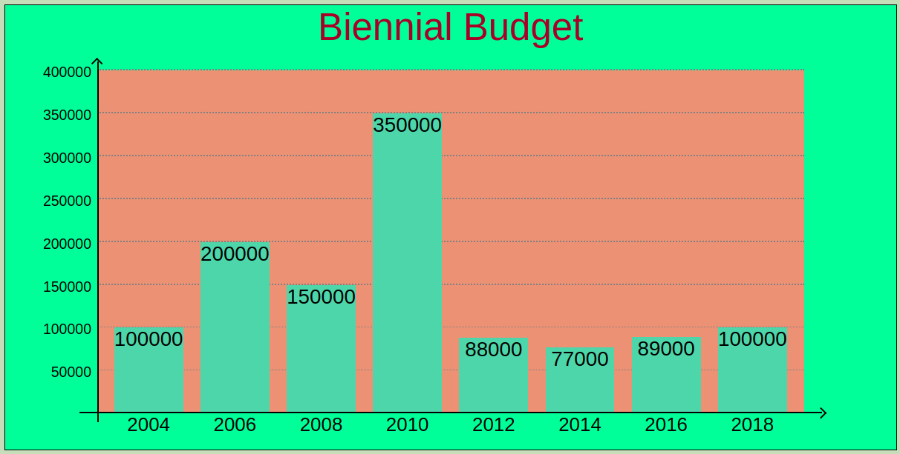
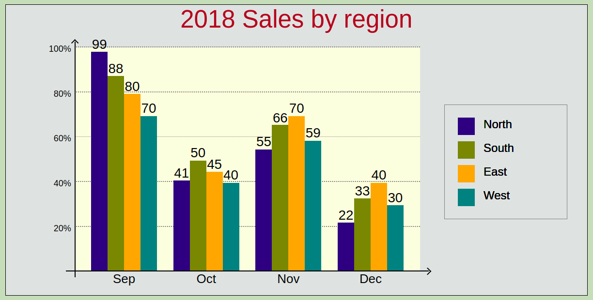

# barChart
bar chart program - LHL project

This is a project for the prep work LightHouse Labs - Web Development Bootcamp, which will start on January 7th, 2019, in Vancouver.

It was asked to the students to develop a function in order to draw a bar chart using only Javascript, JQuery, CSS and HMTL elements.

The function is called by: *barChart(data, options, element)*.
- **Data** is the set of number that will be shown up in the bars. It may be 3 kinds of estrucutures:
  * Simple array, only numbers;
  * Array of objects, where the key is the label and the value is the number;
  * Array of arrays with 4 arrays. The first is the numbers, second is the label for each subcolumn,
      third contains the colors for each subcolumn, and the forth is the X-axis label.
- **Options** contain the fields that the user can set, such as colors, text, sizes, and some chart bar features.
- **Element** is the spot where the chart will be rendered.

Bellow follow one example for each type of data structure:
* **Simple Array** 
>      [100000, 200000, 150000, 350000, 88000, 77000, 89000, 100000],

Bar Chart is:

* **Array of Objects**
>      [{"okay": 10},
>       {"nope": 8},
>       {"yeah": 14},
>       {"bad":   5},
>       {"soso": 9}],

Bar Chart is:        

* **Arrays of Arrays**
>      [[[99, 88, 80, 70], ["North", "South", "East", "West"], ["navy", "olive", "orange", "teal"], "2014"],
>       [[41, 50, 45, 40], ["North", "South", "East", "West"], ["navy", "olive", "orange", "teal"], "2015"],
>       [[55, 66, 70, 59], ["North", "South", "East", "West"], ["navy", "olive", "orange", "teal"], "2016"],
>       [[22, 33, 40, 30], ["North", "South", "East", "West"], ["navy", "olive", "orange", "teal"], "2017"]],      
        

## About options fields
Options are divided in 5 parts:
1. bigFrame Features. This frame will hold all the elements for the bar chart.
It is possible to set the following:
  1.1 _**frameHeight**_ - big frame's height (pixels),
  1.2 _**frameWidth**_ - big frame's width (pixels),
  1.3 _**color**_ - it is the color for the big frame (it can receive any valid string, decimal or hexadecimal), and
  1.4 _**border**_ - border frame's features (format and color).
>  *i.e.:*
>      frameHeight: 400, frameWidth: 800,
>      setBigFrameColor: "#E0E4E3", setBigFrameBorder: "solid 0.5px black",

2. chartFrame features. Some features related to the chart, such as:
  2.1 _**setFrameColor**_ - it will define the chart frame's background color,
  2.2 _**setBarColor**_ - it will be applied for charts with simple columns, and
  2.3 _**setEmphasis**_ (true or false) - when true, it will provide a different style for the hoved columns.

3. chartLabelFeatures defines:
  3.1 _**chartLabelText**_ - it is the chart's title,
  3.2 _**chartLabelFontFamily**_ - it is the font family,
  3.3 _**chartLabelFontSize**_ - size of the font. If the user defines a very big size, the system will adjust in order to fit it in the label element,
  3.4 _**chartLabelFontColor**_ - it is the color of the title,
  3.5 _**chartLabelBorder**_ - it defines border to the title, and
  3.6 _**chartLabelBackColor**_ - it is the background color. If it is not defined, the color will be the same as the big frame's background.

4. X-Axis features has:
  4.1 _**setXLabel**_ - it can receive "month" or "number" as a X label,
  4.2 _**setXLabelStarts**_ - for the cases above, the system can start in a specific month or number. If month, the others labels will be filled automatically,
  4.3 _**setXLabelInc**_ - applied to "numbers", it can increase (positive number) or decrease (for negative numbers),
  4.4 _**setColumnsFont**_ - font's size,
  4.5 _**setColumnWithLabel**_ (true or false) - it turns on or off the labels for the columns,
  4.6 _**setLabelColumnPos**_ - positioning of the label related to the column. It can be *top*, *bottom*, *middle* or *over*,
  4.7 _**setSpaceColumn**_ - it defines the space between the columns. 3 types: "small", "normal" or "extra".

5. Y-Axis features has:
  5.1 _**setMaximunValue**_ - is the parameter for the Y-axis. If no value, the maximum chart's height will be a small number (offset) after the maximum's data.
  5.2 _**numberOfDivisionsYAxis**_ - how many divisions in the Y-axis,
  5.3 _**typeOfDivision**_ - if "percent" or absolute,
  5.4 _**setDivLabelFontSize**_ - font size, and
  5.5 _**setDivisionsOverColumns**_ (true or false) - it will show the division's lines over or under the columns.

## Improvements:
* There is a function to adjust the fontSize attribute within the current element, and it's working to the labelChart element. Applying this function to other elements, such as the Y and X-Axis labels, the legend and columns labels, would give a better outcome.
* Dealing with currencies symbols.
* Figuring out better the case of one more label for the Xs labels, such as year under the months.
* Performing a further code's and its functions review.
* Receiving negative numbers as data and plot it.

